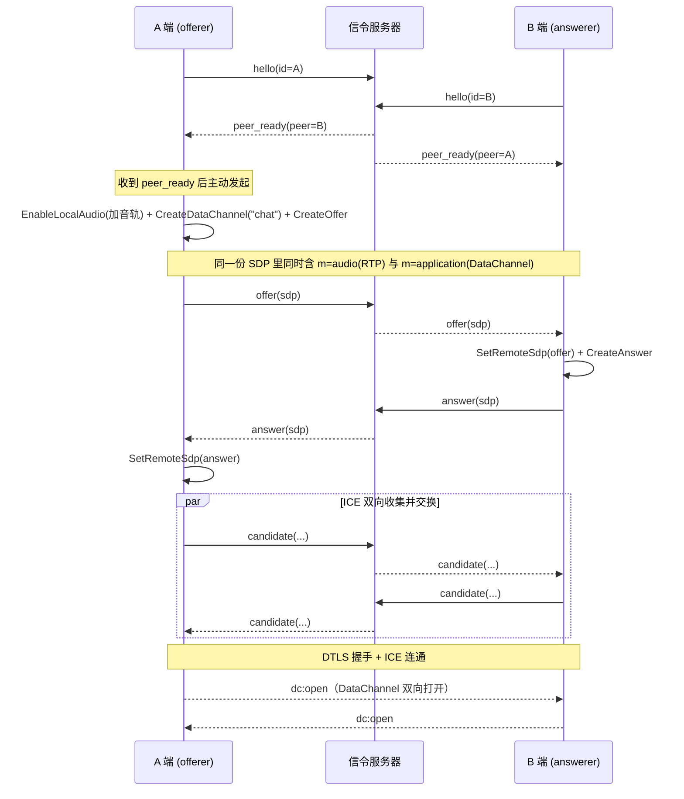
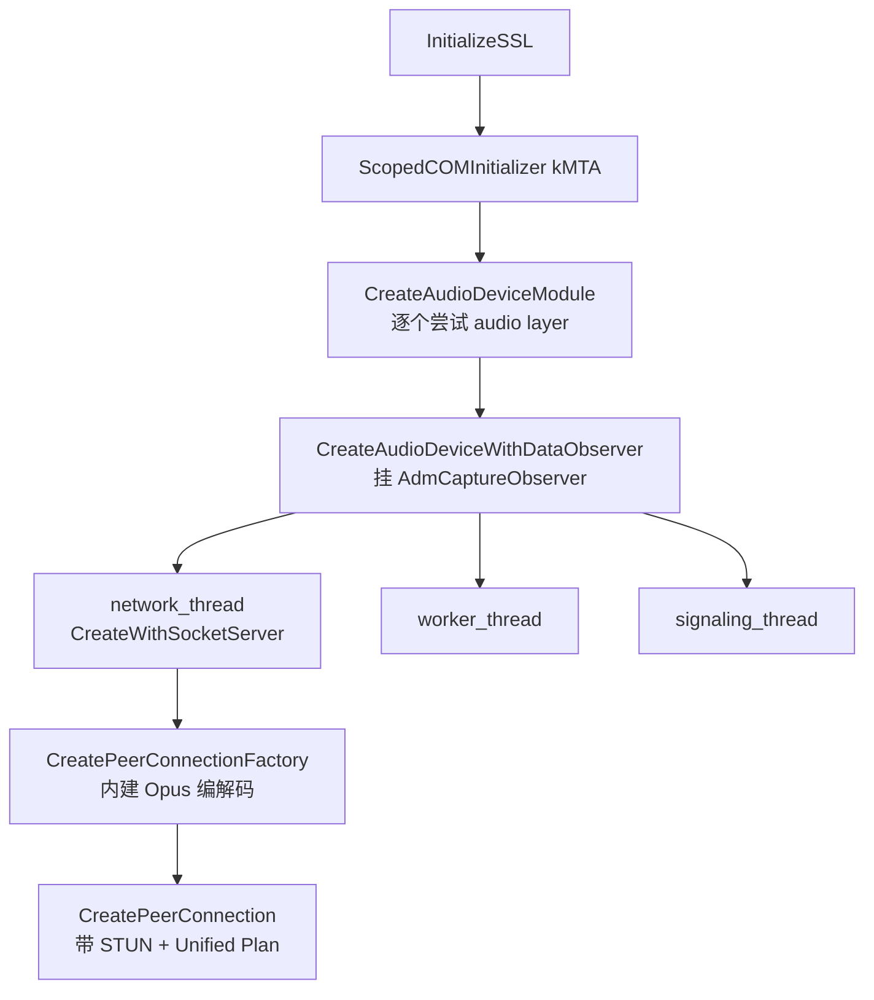
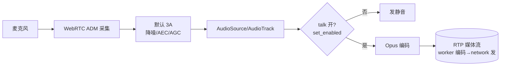
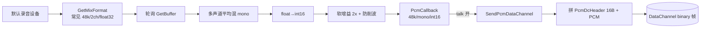
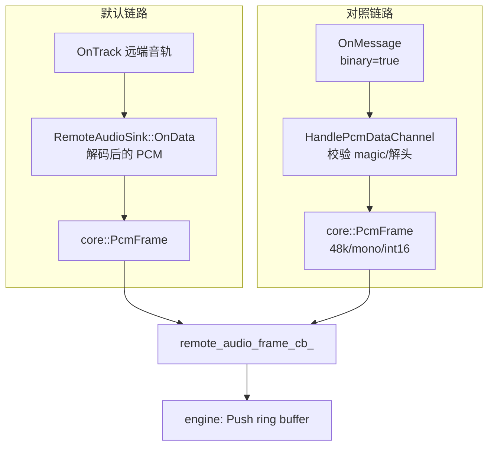
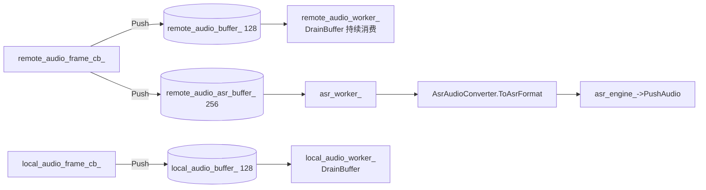
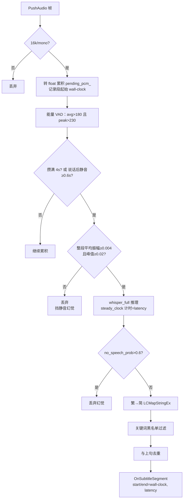
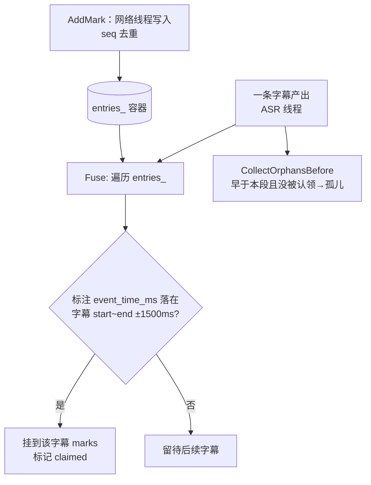
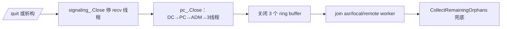

# AudioSub 链路详解（流程图 + 逐环节说明）

本文面向「想彻底搞懂每条链路每个环节」的读者，配合 [docs/current-implementation-flow.md](current-implementation-flow.md)（速查版）一起看。每节都给出：**做什么 → 怎么做（关键代码） → 为什么这么做**，并配流程图 / 时序图。

> 关键事实速记
> - 讲话方恒为 **A（offerer）**，B 是接收/识别方。
> - 信令走 **TCP + 行分隔 JSON**（不是 WebSocket），仅用于交换 SDP/ICE 和在线状态。
> - 一次 Offer/Answer **同时谈妥两条管子**：音频媒体流（m=audio / RTP）+ DataChannel（SCTP）。
> - 音频**默认走 WebRTC ADM 音轨链路**（ADM 采集 + 内建 3A + Opus，经 RTP 媒体流，CLI/GUI 均默认）；另有 **WASAPI 直采 + DataChannel 二进制** 对照链路（绕开 3A）。DataChannel 主要承载文本（标注/回传字幕），仅 WASAPI 模式下额外承载 raw PCM。
> - `ASR` 用本地 `whisper.cpp`；字幕与标注在 **统一现实时间轴（Unix 毫秒）** 上对齐融合，再 **B→A 回传**。

---

## 0. 全局数据流总览

```mermaid
flowchart LR
    subgraph SA[A 端 · 讲话方]
        MIC[麦克风] --> ADM[WebRTC ADM 采集<br/>默认链路]
        ADM --> RTPsend[3A + Opus 编码<br/>RTP 媒体流]
        MIC -. 对照链路 .-> WASAPI[WASAPI 直采]
        WASAPI -. .-> DCsend[DataChannel 二进制<br/>PcmDcHeader + PCM]
        NOTE[标注输入] --> DCanno[DataChannel 文本<br/>annotation JSON]
        ASIG[信令客户端]
        ARECV[显示回传字幕]
    end

    SIG[(信令服务器<br/>TCP/JSON<br/>仅 SDP/ICE)]
    P2P((WebRTC P2P<br/>SRTP 媒体 + SCTP DataChannel))

    RTPsend --> P2P
    DCsend -. .-> P2P
    DCanno --> P2P
    ASIG -. 协商期 SDP/ICE .-> SIG
    SIG -. 转发 SDP/ICE .-> BSIG

    subgraph SB[B 端 · 识别方]
        BSIG[信令客户端]
        SINK[OnTrack→解码 PCM<br/>默认链路] --> RB[(PcmRingBuffer)]
        DCrecv[解包 PcmDcHeader<br/>对照链路] -. .-> RB
        RB --> CONV[格式转换<br/>→16k mono]
        CONV --> ASR[whisper.cpp<br/>VAD + 分段识别]
        ASR --> FUSE[字幕↔标注融合<br/>时间轴对齐]
        DCanno2[收标注 annotation] --> FUSE
        FUSE --> SUBBACK[B→A 回传 subtitle JSON]
    end

    P2P --> SINK
    P2P -. .-> DCrecv
    P2P --> DCanno2
    SUBBACK --> P2P
    P2P --> ARECV
```

整套系统由一个核心引擎 `AudiosubEngine`（[client/audiosub_engine.cc](../client/audiosub_engine.cc)）把下面这些模块接线在一起，CLI 和 Qt GUI 共用它：

| 模块 | 文件 | 职责 |
|------|------|------|
| 信令客户端 | `client/signaling_client.*` | TCP 连接、收发行 JSON |
| WebRTC 封装 | `client/peer_connection_client.*` | PeerConnection、DataChannel、音频收发 |
| WASAPI 采集 | `client/wasapi_mic_capture.*` | 直采麦克风 raw PCM |
| 环形缓冲 | `include/audio/pcm_ring_buffer.h` + `src/...` | 解耦回调线程与处理线程 |
| 格式转换 | `src/audio/asr_audio_converter.cc` | 48k/多声道 → 16k/mono |
| ASR 引擎 | `src/asr/whisper_cpp_engine.cc` | VAD + whisper 推理 |
| 标注协议 | `include/proto/dc_message.h` | annotation/subtitle JSON 编解码 |
| 融合器 | `include/fusion/subtitle_mark_fuser.h` | 字幕与标注时间轴对齐 |

---

## 1. A 与 B 如何建立 P2P 连接（信令 + 媒体）

WebRTC 的两端在直连前，必须先借助一个**信令通道**交换三类信息：SDP（能力/参数）、ICE candidate（网络地址）、在线时机。信令通道本身不属于 WebRTC，本项目用最简单的 TCP + 行 JSON 实现。

### 1.1 信令传输层

- **服务器** [signaling/server.py](../signaling/server.py)：`asyncio` TCP 监听 `8888`，一个全局 `Room` 最多两个 peer。逻辑只有四步：等 `hello` → `join` 后双向发 `peer_ready` → 收到一行就**原样转发**给对端 → 断开时发 `peer_left`。服务器**不解析**业务字段，offer/answer/candidate 都是同一段转发代码。
- **客户端** [client/signaling_client.cc](../client/signaling_client.cc)：Winsock 建 TCP，连上后先发 `{"type":"hello","id":"A"}`；后台 `RecvLoop()` 线程按 `\n` 拆包、解析 JSON、回调给上层。`Send()` 加锁保证一条 JSON 不被并发写打断。

### 1.2 协商时序（SDP + ICE + DataChannel）



关键代码落点（[client/peer_connection_client.cc](../client/peer_connection_client.cc)）：

- A：收到 `peer_ready` → 先 `EnableLocalAudio()`（`AddTrack` 把本地音轨挂上，于是 offer 里会出现 `m=audio`），再 `CreateOfferAndDataChannel()`：建标签为 `"chat"` 的 DataChannel，再 `CreateOffer`。所以**一份 offer 同时谈妥音频媒体流和数据通道**，不是只有 DataChannel。生成的本地 SDP 经 `OnLocalSdpReady → SdpReadyCallback` 抛回业务层并发信令。
- B：收到 `offer` → `SetRemoteSdp(kOffer) → CreateAnswer()`；远端音轨经 `OnTrack()` 到达（接默认音频链路的 sink），对端 DataChannel 经 `OnDataChannel()` 到达并 `RegisterObserver` 绑定到本类。
- 双方 `OnIceCandidate()` 每发现一个本地候选就经信令发给对端，对端 `AddRemoteIceCandidate()` 回喂。
- STUN 服务器配了 `stun.l.google.com:19302`（同机/同局域网其实用不到）。
- 媒体加密：WebRTC 内部用 DTLS，`Initialize()` 里 `InitializeSSL()` 必须先调用。

> **为什么 A 当 offerer**：纯约定。`AudiosubEngine::Start()` 里 `is_offerer_ = (cfg_.id == "A")`，只有 offerer 在 `peer_ready` 时主动建 channel + offer，避免双方同时发起（glare）。

---

## 2. WebRTC 初始化（线程 / COM / ADM / Factory）

`PeerConnectionClient::Initialize()` 顺序：



要点：

- **三个 WebRTC 线程**：`network`（必须带 SocketServer，跑 socket I/O）、`worker`（编解码/媒体）、`signaling`（PC 内部状态机）。它们是 `webrtc::Thread`（带事件循环），让 WebRTC 不阻塞业务线程。
- **COM 必须 MTA**：Windows 上 ADM 走 Core Audio，需要 COM。这里用 `kMTA`。**这正是 Qt GUI 的坑**：Qt 主线程是 STA，所以 GUI 把 `Start()` 放到专属后台线程上初始化（见 [gui/main_window.cpp](../gui/main_window.cpp)）。
- **Factory 带内建音频编解码工厂**（`CreateBuiltinAudioEncoderFactory/DecoderFactory`，即 Opus 等），默认的 WebRTC 音轨链路靠它编解码；WASAPI 对照链路（raw PCM 走 DataChannel）不依赖它。

---

## 3. A 端音频采集与发送

项目里有**两条**音频链路，由 `SetAudioPath()` 切换。**CLI 与 GUI 现在都默认 `webrtc`**（WebRTC ADM 音轨链路）；`wasapi` 是对照链路，用 `--audio-path wasapi` 切换。两条对照：

| | 默认链路 `kWebrtcTrack` | 对照链路 `kWasapiDataChannel` |
|---|---|---|
| 采集 | WebRTC ADM | 自写 WASAPI 直采 |
| 处理 | WebRTC 默认 3A（NS/AEC/AGC） | **无 3A** |
| 编码 | Opus | 不编码，raw PCM |
| 传输 | RTP 媒体流（SRTP） | DataChannel 二进制帧 |
| B 端入口 | `OnTrack` → `RemoteAudioSink::OnData` | `OnMessage(binary)` → `HandlePcmDataChannel` |

> 不管走哪条，`Initialize()` 都会创建 **WebRTC ADM**，`EnableLocalAudio()` 也都会用它建一条 WebRTC 音轨。区别只在"发给 B 的语音实际走 RTP 还是 DataChannel"。

### 3.1 默认链路：WebRTC ADM 音轨（RTP）



- 采集靠 ADM（`Initialize()` 里建，Windows 下走 Core Audio，需 COM-MTA）。
- `EnableLocalAudio()` 用 `CreateAudioSource` + `CreateAudioTrack` 建本地音轨并 `AddTrack`，让首个 Offer 就带上 audio `m=` section。
- `SetLocalAudioEnabled(true/false)`（即 GUI 的"开始说话"/CLI 的 `/talk`）→ `set_enabled` 控制这条音轨是否发有效语音；内部还处理了某些设备需先 `StartPlayout` 再 `StartRecording` 的兼容问题。
- 音频在 worker 线程做 Opus 编码、network 线程发 RTP。
- **代价**：3A 在同机调试下会把弱人声当噪声削掉，这正是下面 WASAPI 对照链路存在的原因。

### 3.2 对照链路：WASAPI 直采 → DataChannel 发送



- 采集线程 [wasapi_mic_capture.cc](../client/wasapi_mic_capture.cc) `CaptureThreadMain()`：`CoInitializeEx(MULTITHREADED)` → 默认 `eCapture` 设备 → `IAudioClient` 共享模式 1 秒缓冲 → 轮询 `GetNextPacketSize/GetBuffer`，把任意声道/位深统一**混成 mono、转 int16、施加 2x 软增益**后回调。采样率跟系统 mix format 走（通常 48000）。
- **讲话开关**：talk 开时 `wasapi_talking_` 为 true，回调里才真正调 `SendPcmDataChannel`；off 时采集照跑但不发送。
- **打包协议**（[peer_connection_client.cc](../client/peer_connection_client.cc) `SendPcmDataChannel`）：每个二进制帧前缀一个 16 字节定长头：

```c
#pragma pack(push, 1)
struct PcmDcHeader {
  char     magic[4];        // "PCM1"
  uint32_t sample_rate;     // 48000
  uint16_t channels;        // 1
  uint16_t bits_per_sample; // 16
  uint32_t sample_count;    // int16 样本数（非字节数）
};
#pragma pack(pop)  // sizeof == 16
```

即 raw PCM **不经任何音频编码**，原样塞进 DataChannel（SCTP over DTLS），保真喂给 ASR。

> **为什么保留这条对照链路**：同机调试时远端没有真实扬声器回声参考，WebRTC 的 3A 降噪会把弱人声也削成底噪，导致 whisper 听不清、凭训练先验"幻觉"出「谢谢观看」之类短语。WASAPI 直采绕开 3A 可对照验证。详见 [wasapi_mic_capture.h](../client/wasapi_mic_capture.h) 顶部注释。

---

## 4. B 端如何从 WebRTC 收集音频（RingBuffer 设计 + 存取线程）

### 4.1 收包入口（两条链路对应两个入口）



- 默认链路（WebRTC 音轨）：`OnTrack` 拿到远端 `AudioTrack` → `AddSink(RemoteAudioSink)`；WebRTC 解码完一帧就回调 `OnData`，整理成 `core::PcmFrame`。
- 对照链路（WASAPI/DataChannel）：`OnMessage` 看到 `binary=true` → `HandlePcmDataChannel`：校验 `"PCM1"` magic、读 `sample_count`、拼回 `core::PcmFrame`，调 `remote_audio_frame_cb_`。
- 两条链路最终都汇到同一个回调 `remote_audio_frame_cb_`，下游处理完全一致。

### 4.2 PcmRingBuffer 设计

[include/audio/pcm_ring_buffer.h](../include/audio/pcm_ring_buffer.h) + [src/audio/pcm_ring_buffer.cc](../src/audio/pcm_ring_buffer.cc) 是一个**线程安全、定容、丢旧帧**的帧队列：

- 内部 `std::deque<PcmFrame>` + 一把 `mutex` + 一个 `condition_variable`。
- `Push`：满了就 `pop_front()` **丢最旧的一帧**（保证实时性，宁愿丢历史也不阻塞采集/网络回调），再 `push_back` + `notify_one`。关闭后 `Push` 返回 false。
- `WaitPop`：`cv.wait` 直到「有数据」或「已关闭」；关闭且空时返回 `nullopt`，消费线程据此退出。
- `Close`：置 `closed_` 并 `notify_all`，唤醒所有阻塞的消费者优雅退出。

**为什么用它**：把"WebRTC/网络回调线程"（生产者，不能阻塞）和"ASR 重计算线程"（消费者，慢）解耦。生产者只管丢进缓冲立即返回，消费者按自己节奏取。

### 4.3 存取线程模型（在 AudiosubEngine 里接线）

[client/audiosub_engine.cc](../client/audiosub_engine.cc) 创建了三个 ring buffer 和三个后台线程：



- 收到的远端 PCM 同时 `Push` 进两个缓冲：`remote_audio_buffer_`（容量 128，仅被 `remote_audio_worker_` 抽干，留作电平监视/扩展）和 `remote_audio_asr_buffer_`（容量 256，喂 ASR）。
- `asr_worker_`：`WaitPop` 取帧 → `AsrAudioConverter::ToAsrFormat` 转 16k/mono → `whisper PushAudio`。
- 退出时 `Close()` 三个缓冲 → 三个线程 `WaitPop` 返回空 → `join`。

---

## 5. ASR：从 PCM 到字幕（VAD / 分段 / 幻觉过滤 / 延迟）

[src/asr/whisper_cpp_engine.cc](../src/asr/whisper_cpp_engine.cc)，输入必须是 **16k/mono/16bit**（否则直接丢弃）。



要点：

- **双重 VAD/能量门限**：帧级 VAD（`avg_abs>180 && peak>230`）驱动"说话/静音"状态机；推理前再对整段做平均振幅(≥0.004)+峰值(≥0.02)门限。这两层主要为了挡住静音/底噪被 whisper 幻觉成「谢谢观看」。
- **分段策略**：攒满 4 秒（`kSegmentSamples=64000`）强制 flush，或说话后连续静音 ~0.6 秒（60 帧）且已攒够 1 秒提前 flush。每次 flush = 一次 `whisper_full` = 一段字幕，随后清空（不做滑窗重复识别）。
- **三道幻觉防线**：能量门限 → whisper 的 `no_speech_prob>0.6` → 关键词黑名单（"谢谢观看/点赞/字幕"等）。
- **繁→简**：whisper 中文默认输出繁体，用 Win32 `LCMapStringEx` 转简体。
- **延迟指标**：用 `steady_clock` 量 `whisper_full` 耗时写进 `SubtitleSegment::latency_ms`，作为端到端字幕延迟近似。
- **时间轴**：字幕 `start_ms` 取该段音频**首帧进缓冲的 Unix 毫秒**，`end_ms` 取识别完成时刻——这样字幕和标注能在同一条现实时间轴上对齐。

---

## 6. 标注通道（A → B）

[include/proto/dc_message.h](../include/proto/dc_message.h)：标注和回传字幕都走**同一条 DataChannel 的文本帧**，用 JSON 的 `type` 字段区分。

标注消息结构：

```json
{ "type": "annotation", "seq": 7, "event_time_ms": 1717200000123,
  "payload": { "text": "这里是重点" } }
```

- 发送：`AudiosubEngine::SendNote()` 自增 `seq`、取当前 Unix 毫秒为 `event_time_ms`，`Serialize` 后 `pc_.SendMessage`（文本帧 binary=false）。
- 接收：`OnMessage`（binary=false）→ `HandlePeerMessage`，按 `type` 分流。`annotation` 交给融合器 `AddMark`（按 `seq` 去重），并算**可见延迟** `now - event_time_ms`。
- 文本帧 vs 二进制帧：同一条 channel 上，`binary=true` 是 WASAPI PCM，`binary=false` 是这套 JSON 协议，互不干扰。

---

## 7. 字幕与标注融合（统一时间轴对齐）

[include/fusion/subtitle_mark_fuser.h](../include/fusion/subtitle_mark_fuser.h)：



- **对齐判据**：标注发生时刻是否落在 `[字幕start - 容差, 字幕end + 容差]`，容差 `kToleranceMs=1500ms`（人通常比"开始说"晚几百毫秒才敲下标注，给缓冲更稳）。命中就挂到该字幕的 `marks` 并标记 `claimed`。
- **孤儿标注**：一条标注若发生时刻早于"当前字幕起点-容差"却仍没被认领，未来字幕只会更晚、不可能再匹配，于是判为"无归属"，通过 `orphan` 回调单独展示，**保证标注不会凭空消失**。退出时 `CollectRemainingOrphans` 兜底把剩余的全抛出。
- **线程安全**：`AddMark`（网络线程）与 `Fuse`（ASR 线程）并发访问，内部一把 `mutex`。

最终输出结构 `EnhancedSubtitleSegment`：字幕正文 + 时间范围（start/end）+ 对应标注列表。

---

## 8. B → A 字幕回传

B 端每产出一条增强字幕，`OnSubtitleSegment` 末尾把它打包成 `type:"subtitle"` 的 JSON（含 index/start/end/latency/text/marks）发回 A：

```json
{ "type":"subtitle", "index":3, "start_ms":..., "end_ms":...,
  "latency_ms":820, "payload":{"text":"..."},
  "marks":[{"seq":7,"text":"...","err_ms":120}] }
```

A 端 `HandlePeerMessage` 收到 `subtitle` → 还原成 `SubtitleEvent(remote=true)` 抛给 UI。于是 **A 也能看到自己说的话被识别成的字幕**。在 Qt GUI 里，由于讲话方恒为 A，字幕在 A 端显示在右侧（"我说的"），在 B 端显示在左侧（"对端 A 说的"）——两端都清楚归属于 A。

---

## 9. 指标观测（三项 + 退出汇总）

| 指标 | 目标 | 计算点 | 代码 |
|------|------|--------|------|
| 端到端字幕延迟 `lat` | ≤1500ms | `whisper_full` 推理耗时 | `RunInference` steady_clock |
| 标注匹配误差 `err` | ≤500ms | 标注时刻到字幕时间窗的距离 | `MarkMatchError` |
| DataChannel 可见延迟 `vis` | ≤300ms | `now - event_time_ms`（接收方侧） | `HandlePeerMessage` |

- 三项都用线程安全的 `MetricStat{count,sum,max}` 累计（`AddLat/AddErr/AddVis`，一把 `metrics_mutex_`）。
- CLI 退出时打印均值/峰值汇总；GUI 顶部指标条 `QTimer` 每 500ms 拉一次快照刷新。
- `vis` 只有**接收标注的那一端**才有样本：如果你在发标注的 A 端，看到"可见延迟 暂无样本"是正常的，要在对端观察。

---

## 10. 退出清理链路



顺序很重要：先停信令，再关 WebRTC（卸载 remote sink 防止回调访问悬空对象），再 `Close` ring buffer 让消费线程从 `WaitPop` 返回并 `join`。GUI 还要先停 `QTimer`、再在专属引擎线程上 `audiosub_stop`。

---

## 11. 还可以深入学习的点

- **WebRTC ICE/STUN/TURN/NAT 穿透**：本项目只配了 STUN，跨公网需要 TURN 中继。
- **SCTP over DTLS（DataChannel 底层）**：可靠/有序传输、消息分片、`bufferedAmount` 背压。
- **Opus 编码与 WebRTC 3A（AEC/NS/AGC）**：默认链路用到；理解为什么需要 WASAPI 对照链路绕开它。
- **重采样质量**：当前 `ResampleLinear` 是线性插值，专业做法用多相 FIR / sinc，注意抗混叠。
- **VAD**：现在是能量门限，工业级用 WebRTC VAD 或 Silero VAD（基于模型）。
- **whisper 流式/滑窗**：当前是固定分段，进阶可做 overlap 滑窗 + 增量解码降低延迟。
- **时钟同步**：跨机时两端 Unix 时钟可能有偏差，会影响 `vis`/对齐，生产环境需 NTP 或相对时钟校正。
- **C ABI 跨运行时**：为什么 WebRTC(`/MT`) 与 Qt(`/MD`) 必须用纯 C 接口 DLL 隔离，见 [client/capi/audiosub_capi.h](../client/capi/audiosub_capi.h)。
- **COM 套间模型（STA vs MTA）**：Qt 主线程 STA 与 WebRTC 要求 MTA 的冲突，及其后台线程化解法。

---

## 附：关键文件索引

| 关注点 | 文件 |
|--------|------|
| 总接线 / 线程 / 缓冲 | `client/audiosub_engine.cc` |
| 信令服务器 | `signaling/server.py` |
| 信令客户端 | `client/signaling_client.{h,cc}` |
| WebRTC / 协商 / 音频收发 | `client/peer_connection_client.{h,cc}` |
| WASAPI 采集 | `client/wasapi_mic_capture.{h,cc}` |
| 环形缓冲 | `include/audio/pcm_ring_buffer.h`, `src/audio/pcm_ring_buffer.cc` |
| 格式转换 | `include/audio/asr_audio_converter.h`, `src/audio/asr_audio_converter.cc` |
| ASR | `include/asr/whisper_cpp_engine.h`, `src/asr/whisper_cpp_engine.cc` |
| 标注协议 | `include/proto/dc_message.h` |
| 融合器 | `include/fusion/subtitle_mark_fuser.h` |
| 核心数据类型 | `include/core/types.h` |
| C ABI / GUI | `client/capi/*`, `gui/*` |
